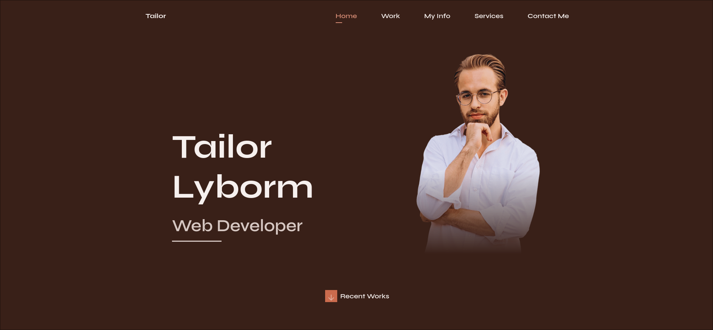

# Website-HTML5-CSS3

# Personal Portfolio Website (Tailor Lyborm)




## 📄 Descripción del Proyecto

Este proyecto consiste en un **Portafolio Web Personal Responsivo** desarrollado para la clase de Diseño Web. El sitio ha sido construido bajo la metodología **"Mobile First"**, asegurando una experiencia de usuario óptima en dispositivos móviles antes de escalar a pantallas de escritorio.

El diseño presenta una estética moderna con un tema oscuro (Dark Theme), implementando animaciones fluidas al hacer scroll y una interfaz de usuario limpia y profesional. El objetivo principal es mostrar habilidades técnicas, proyectos recientes y proporcionar un medio de contacto directo.

## 🚀 Características Clave

Basado en la implementación del código (`main.js` y `styles.css`), el sitio incluye las siguientes funcionalidades:

* **Menú de Navegación Responsivo:** Sistema de menú *toggle* que se adapta a móviles, con animaciones de apertura y cierre, y cierre automático al seleccionar una opción.
* **Header con Efecto Blur:** La barra de navegación detecta el scroll y aplica un efecto de desenfoque (`blur-header`) para mejorar la legibilidad sin perder el contexto visual.
* **Sección Activa (Scroll Spy):** El menú de navegación se actualiza automáticamente, resaltando la sección actual que el usuario está visualizando en pantalla.
* **Botón 'Scroll Up':** Un botón flotante aparece discretamente cuando el usuario desciende más de 350px, permitiendo volver al inicio rápidamente.
* **Formulario de Contacto Funcional:** Integración con **EmailJS** para el envío de correos electrónicos directamente desde el frontend, con validación básica y mensajes de estado (éxito/error).
* **Animaciones ScrollReveal:** Aparición secuencial y suave de elementos (imágenes, textos, tarjetas) a medida que el usuario navega por la página.
* **Diseño Visual HSL:** Uso avanzado de variables CSS y el modelo de color HSL para una gestión consistente de la paleta de colores y el modo oscuro.

## 🛠️ Tecnologías Utilizadas

### Core
* **HTML5:** Estructura semántica del contenido.
* **CSS3:** Flexbox, CSS Grid, Media Queries y Variables CSS personalizadas.
* **JavaScript (Vanilla):** Lógica del DOM, eventos de scroll y control de menú.

### Librerías y Recursos Externos
* **[ScrollReveal.js](https://scrollrevealjs.org/):** Para animaciones de entrada al hacer scroll.
* **[EmailJS](https://www.emailjs.com/):** Servicio para conectar el formulario HTML con servicios de correo electrónico.
* **[Remix Icons](https://remixicon.com/):** Set de iconos open-source neutrales.
* **[Google Fonts](https://fonts.google.com/):** Tipografía 'Syne' para un estilo visual único.

## 📂 Estructura del Proyecto

```text
WEBSITE-HTML5-CSS3/
├── css/
│   └── styles.css           # Estilos principales y variables
├── img/
│   ├── favicon.png          # Icono de la pestaña
│   ├── home-perfil.png      # Imagen principal
│   ├── [work-images].jpg    # Imágenes de proyectos
│   └── [tech-icons].svg     # Iconos de habilidades (HTML, CSS, etc.)
├── js/
│   ├── main.js              # Lógica principal del sitio
│   └── scrollreveal.min.js  # Librería de animaciones minificada
├── pdf/
│   └── Tailor-Cv.pdf        # Curriculum Vitae descargable
├── index.html               # Archivo principal HTML
├── LICENSE                  # Licencia del proyecto
└── README.md                # Documentación del proyecto